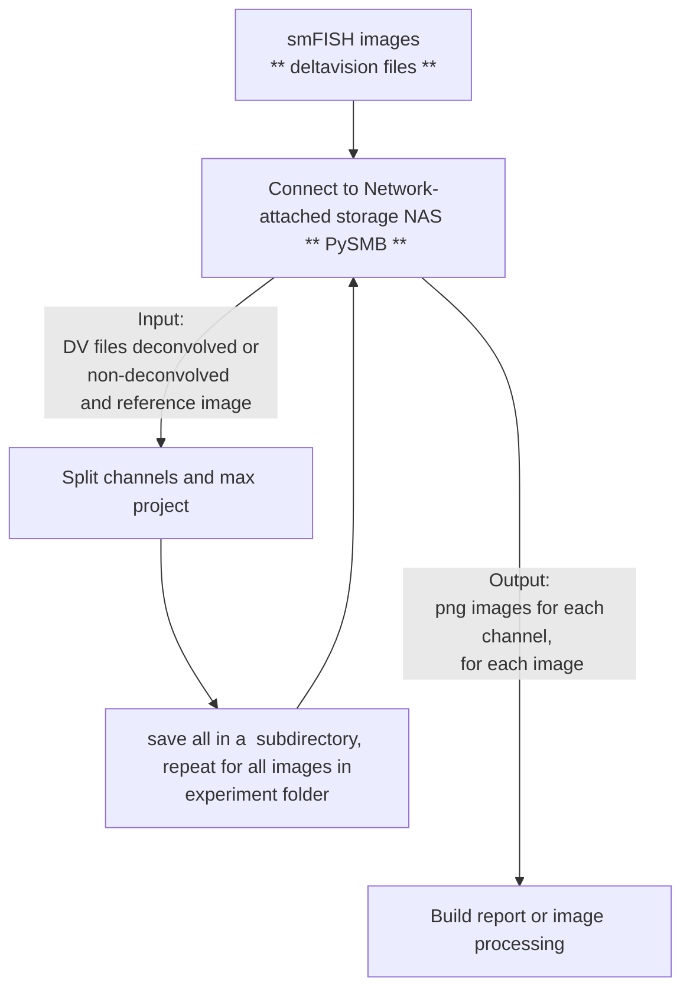

# Automated smFISH quantification for C. elegans embryos
Author: Naly Torres, Luis de Lira Aguilera, PhD

# Description
Repository to automatically perform spot detection of smFISH in C. elegans embryos. This repository requires high performance computing on a remote server (Alpine-HPC). Non-deconvolved microscope images are loaded in organized subdirectories. Cell segmentation is performed using Cellpose and spot detection using FISHquant. Pandas in Python is used to automatically collect all the data as a dataframe and csv files. -- in R is used for statistical analysis and Flexdashboard for building an interactive experiment report that includes snapshot of the image, segmentation masks (sytoplasmic and nuclei), plot of automated threshold selection per image, per channel. 

# Code Architecture




# Code overview
## Transfer data from local to remote environment

## Cell segmentaion (Cellpose)
Uses FISHquant

## Spot detection (BigFish)
Save files as png in subdirectories
Uses Python

## Data analysis and visualization

# Installation
> [!TIP]
> Install [Anaconda](https://www.anaconda.com/) before installing this repository and all its dependencies.

* Create conda environment
```
# conda create --name dv2png_env
conda create --name dv2png_env --file dv2png_env.yml
```
* Activate conda environment
```
conda activate dv2png_env
```
* Clone git repository
```
git clone --depth 1 https://github.com/TorresNaly/dv2png.git
```
#### Last edited Jan 11th, 2024. 


