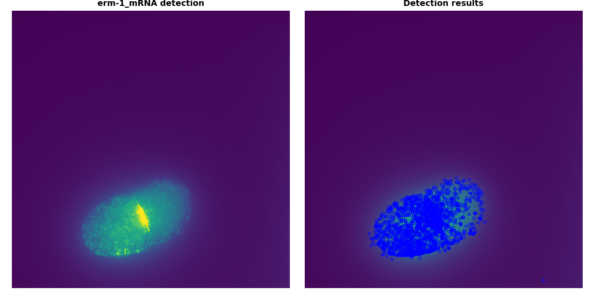

# Automated smFISH quantification for C. elegans embryos

Author: Naly Torres, PhD candidate

Erin O. Nishimura's Lab at Colorado State University

Collaborators: Luis de Lira Aguilera PhD, Karissa Coleman BS, Bryan Musky, Erin Osborne Nishimura

(October 6th, 2024) This repo is currently being edited: If you are interested or have questions please email: naly.torres@colostate.edu 

# Description
Software to analyze smFISH images of C. elegans embryos in python. Requires non-deconvolved microscope images in organized subdirectories. Cell segmentation is performed using Cellpose and spot detection using FISHquant. Output is a csv file with mRNA counts per embryo and a report with images of the spot detection and segmentaion masks.


# Code overview
## Cell segmentaion
Uses Cellpose


## Spot detection
Save files as png in subdirectories
Uses Python



## Calculate colocalization with C. elegans feautures
mRNA-membrane colocalization


mRNA-p granules colocalization


mRNA-nuclei colocalization


mRNA-mRNA colocalization


## Data analysis and visualization

# Installation
> [!TIP]
> Install [Anaconda](https://www.anaconda.com/) before installing this repository and all its dependencies.

* Create conda environment
```
# conda create --name ce-bigfish
conda create --name ce-bigfish --file ce-bigfish.yml
```
* Activate conda environment
```
conda activate ce-bigfish
```
* Clone git repository
```
git clone --depth 1 https://github.com/TorresNaly/ce-bigfish.git
```
#### Last edited Oct 1st, 2024. 


